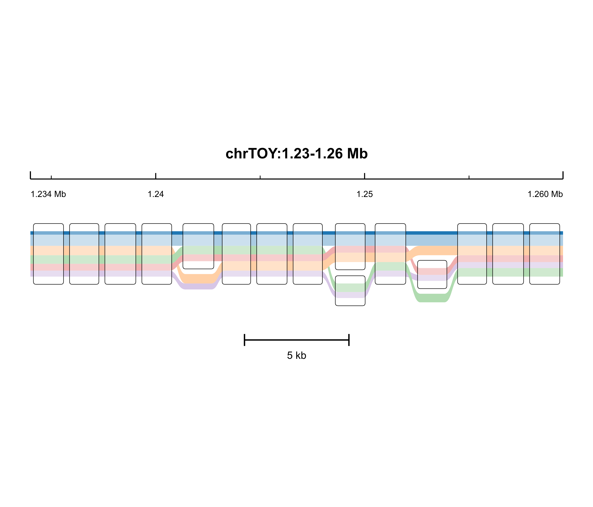

# Panviz

Panviz is the development workspace for a static, publication-oriented
sequence tube map renderer.



*Example: the bundled toy locus (`examples/`) showing a deletion, a substitution,
and an insertion across a reference and five haplotypes. See
[docs/FIGURE_ANATOMY.md](docs/FIGURE_ANATOMY.md).*

## Try it in 30 seconds

```bash
cd /path/to/Panviz
python3 bin/panviz render --config config/mainfig_baseline.json \
  --input-root examples/toy_data --only toy_locus --out-root results/toy
# -> results/toy/toy_locus/toy_locus_sequencetubemap_mainfig_natural.{svg,pdf,png}
```

Documentation: [input format](docs/INPUT_FORMAT.md) ·
[figure anatomy](docs/FIGURE_ANATOMY.md) · [examples](examples/README.md)

This repository starts from the accepted `2-C_quinoa/tmp/Panviz` baseline but
is intended to evolve into an independent plotting tool. The current development version carries an upstream-derived core copy in
`src/panviz_core/`, while Panviz owns the GFA conversion, static export, axis
annotation, horizontal compaction, and publication styling layer.

## Baseline Policy

The accepted rendering scripts and outputs in the quinoa project are kept
unchanged:

```text
/data9/home/qgzeng/projects/2-C_quinoa/tmp/Panviz
/data9/home/qgzeng/projects/2-C_quinoa/tmp/static_svg_rendered_sequencetubemap_mainfig_axis_ticks_x032_trial_20260630
```

Development work should happen here:

```text
/data9/home/qgzeng/projects/3-Biotools_create/Panviz
```

## Command-line interface

Panviz ships a `panviz` CLI (Python standard library only). It runs without
installation via the launcher, or as an installed console script:

```bash
cd /data9/home/qgzeng/projects/3-Biotools_create/Panviz

# Run without installing
python3 bin/panviz --help

# Or install the CLI (pure-Python, no network needed)
pip install -e .
panviz --help
```

Subcommands:

```bash
panviz render     # convert locus packages and export static SVG/PNG/PDF
panviz validate   # check locus-package inputs without rendering
panviz version    # print the Panviz version
```

Render settings resolve with precedence: package defaults < `--config <json>`
< explicit flags. See `config/defaults.json` for the full key list.

Reproduce the accepted baseline (all default loci):

```bash
bash run_panviz_mainfig.sh
# equivalent to: python3 bin/panviz render --config config/mainfig_baseline.json
```

Render one locus to a scratch directory:

```bash
python3 bin/panviz render --config config/mainfig_baseline.json \
  --only 04_KAS_I_II_KAS_I_II_chr03B --out-root results/smoke_04
```

Validate inputs first:

```bash
python3 bin/panviz validate --only 04_KAS_I_II_KAS_I_II_chr03B
```

> `render_pantubemap_mainfig.py` is kept as a deprecated shim that forwards to
> `panviz render`; prefer the CLI.

## Main Files

There is no top-level `sequenceTubeMap/` runtime directory. The required
upstream-derived rendering code has been copied into Panviz-owned source files.


```text
panviz/                             # Panviz Python package (the tool)
  cli.py                            #   command-line interface (render/validate/version)
  config.py                         #   defaults + JSON config + precedence merge
  discover.py                       #   locus-package discovery
  gfa.py                            #   GFA/path_groups/region -> render payload
  render.py                         #   render orchestration (-> Node export adapter)
  validate.py                       #   input/output validation
bin/panviz                          # CLI launcher (no install required)
pyproject.toml                      # packaging + `panviz` console script
config/                             # render configuration
  defaults.json                     #   documented default settings
  mainfig_baseline.json             #   accepted 2026-06-30 baseline parameters
run_panviz_mainfig.sh               # baseline run wrapper (-> panviz render)
render_pantubemap_mainfig.py        # deprecated shim -> panviz render
harness/export_mainfig_natural.js   # static export adapter (Node + playwright)
harness/render_page.html            # local browser render page
harness/tubemap_exact_entry.js      # adapter to the Panviz core renderer
src/panviz_core/tubemap.js          # upstream-derived Panviz layout core (MIT)
```

## Current Baseline Parameters

- upstream SequenceTubeMap commit: `33b7a7e5df9f8052974ef8e6c689a031dac6e2c9`
- x compression: `0.32`
- panel width: `1800`
- top genomic axis with endpoint labels
- short upward-only axis ticks
- lower scale bar
- regularized rounded node outlines
- no `preserveAspectRatio="none"` non-uniform SVG squeezing


## JavaScript Runtime Dependencies

Panviz currently carries a minimal local `node_modules/` runtime dependency copy.
It is not a symlink. The current copied runtime dependency is:

```text
node_modules/playwright-core 1.61.1
```

The browser bundle in `harness/dist/` already contains the bundled Panviz core
and D3-based drawing logic. When the core is edited, rebuild the bundle after
installing the full JavaScript development dependencies.

## Development Goal

The goal is to turn Panviz from a SequenceTubeMap export adapter into its own
static plotting software. A practical route is:

1. Keep the accepted baseline reproducible.
2. Isolate official SequenceTubeMap-derived code inside `src/panviz_core/` with provenance headers.
3. Move custom logic from `harness/export_mainfig_natural.js` into Panviz-owned
   modules under `src/`.
4. Gradually replace layout, geometry, styling, and axis logic with Panviz
   implementations.
5. Keep visual regression tests against the accepted 17-locus baseline.

## License Note

SequenceTubeMap is MIT licensed. The original license is copied in:

```text
LICENSES/SequenceTubeMap_LICENSE.txt
```

Any Panviz release that includes SequenceTubeMap-derived code must retain the
MIT license notice.

